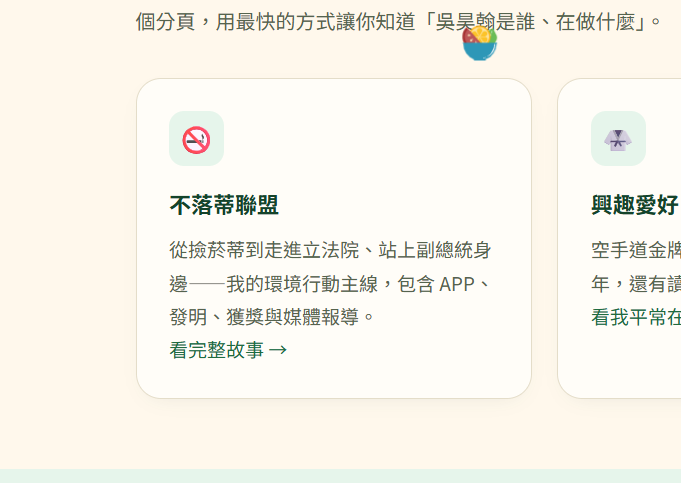

幫我新增以下事項:

1.讓我可以調整語言為英文及日文
2.在不落蒂聯盟裡有很多要修改:
幫我具體標示所有的行動，你能分成以下幾大類去做分隔:
實體倡議
國際交流
入校宣導
媒體報導
參加比賽
藝術創作
科技創新
在科技創新裡面幫我把我的APP做成那裏面的其中一個分頁
並且說明一下我是不落蒂聯盟的創辦人兼任隊長
3.如果有地方需要用到圖片，盡量幫我已看起來有領導能力為主
4.技能樹那裡也有很多要更動
上半部太多餘了直接到技能數那裏
[www.instagram.com/reel/DZjE4EFhc0d/?utm_source=ig_web_copy_link&amp;stkn=MzRlODBiNWFlZA==](https://www.instagram.com/reel/DZjE4EFhc0d/?utm_source=ig_web_copy_link&stkn=MzRlODBiNWFlZA==)這是棍舞影片
現在不能點到每個既能查看細節，幫我做更改
4.北極考察那裏幫我變得更學術性質一點，找的到的話我之前應該有寫過了但是更新後你把它刷掉了看找不找地回來
首頁有一個地方叫做這網站再說什麼那裏下面三個幫我設計成點擊他會帶你到相對應的分頁
5.如果滑鼠有滑到一個區塊，舉例像是
這個，幫我做他會有一點點起伏的感覺，[reclothkids.zeabur.app](https://reclothkids.zeabur.app/)可參考這網站是如何做的
6.翻譯功能的按鍵現在很醜，也有很多缺失幫我看一下並且更動
7.整個網站出現了非常多的bug幫我逐一排查且更動.
