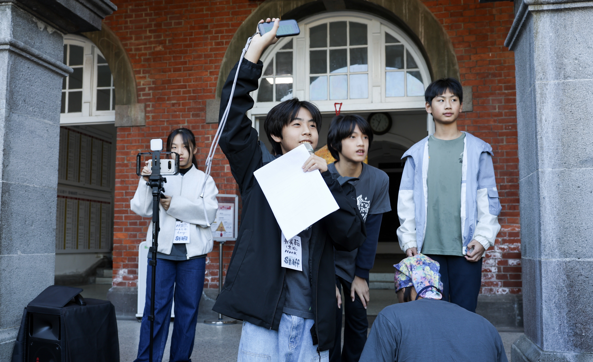
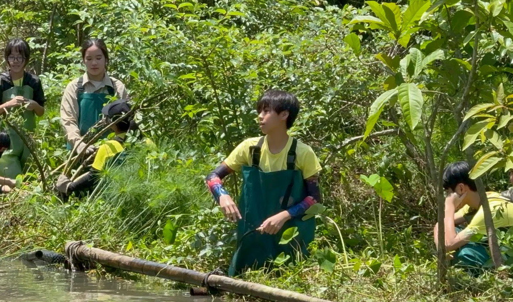

1.首頁 hero換這張

 荒野保護協會(SOW)專屬照片

(一)五國青年網絡-韓國/美國對口組織名稱
1.美國
(a)20240622國中生Alice
(b)20240318奧瑞岡高中生
2.加拿大
(a)20240203加拿大視訊交流
(B)加拿大實體交流

3.20240626法國菸蒂觀察及倡議
4.20240722西班牙交流
5.日本
a.20250702台日視訊交流(第一次、夢丘中學)
b.20250826第二次台日交流(夢丘中學
c.20260121第三次台日視訊交流(夢丘中學
D20260130台日實體交流!
.韓國20240101

幫我新增一個建立分隊並且我們有三重分隊加拿大分隊以及成功(高中)分隊以及日本分隊

(二)要幫我新增的活動
1.20231210與董事基金會前董事長黃鎮台先生請益(確定了行動以倡議為主)
2.20240118懷生國小第一次
3.20240310荒野保護協會北區聯團-五股溼地年華擺攤+倡議
4.20240315台北市福新國小六年丁班
5台灣師範大校園內倡議
6.新加坡菸蒂考察
7.日本菸蒂考察
8.20240325慈心華德福小學六年級A班倡議
9.20240331國家教育研究院倡議
10.20240330蘆洲中華里蔡宜峰里長倡議
.11.20240419
中華里里民倡議
12.20240605環境部記者會
1320240608海科館倡議+擺攤+行動劇
14 20240618蘇澳南安國中倡議
15.20240603台北市溪口國小倡議
16.20241124早安荒野錄音
17.20250105兒童行動論壇(自主舉辦
18.20250215諸神的黃昏(行動劇+南海劇場
19.20250301第一次經驗傳承
20.20250519台灣師範大學演講
21.環島倡議(你有放但沒有照片
22.20250704與林月琴立委倡議
23.20250805受訪少年新聞周刊
24.20250821張雅琳立委倡議
25.20250825豐珠國中入班宣導(因學校特殊無法拍攝)
2620231222與柯文哲總統候選人倡議(受挫、選擇要更努力)
27.20250903氣候變遷公聽會
28.20250920基隆潮境公園-世界淨灘日擺攤
29.20251005DFC十五周年特展短講
30.20251024永續經濟循環展
31.20251123生活速寫展
3220251205第二屆亞太青年高峰會
3320251210全國兒少大會-討論呼吸權
3420251221.**好鄰居兒少成果會**
3520260104第二屆兒少行動論壇(自己舉辦在建國中學+三百多人參與)
36.20260406與**明道中學線上倡議**
3720260403經驗傳承2
3820260704 NoButts Day(響應荷蘭組織No plastic filter的世界無菸蒂日)
3920260706錄製podcast精算媽咪的家計簿
4020260704客家電視台練習生衝一波(拍戲
4120260704濕地藝術節擺攤
42大逆光劇組拍攝(目前還沒上映片名:欸!我們來真的
4320250403撿菸派對

照片在這個連結[drive.google.com/drive/u/0/folders/1O5hK5zSh8gQtcKj7c1vqjvnfFkfFJ8le](https://drive.google.com/drive/u/0/folders/1O5hK5zSh8gQtcKj7c1vqjvnfFkfFJ8le)從 IMG_6633.Jpeg對應到(二)的第一個IMG_6635.Jpeg對應到(二)的第二個以此類推由又到左由下到上

在關於我那裏幫我追加一個台新志工菁英獎以及 eco hero awards
